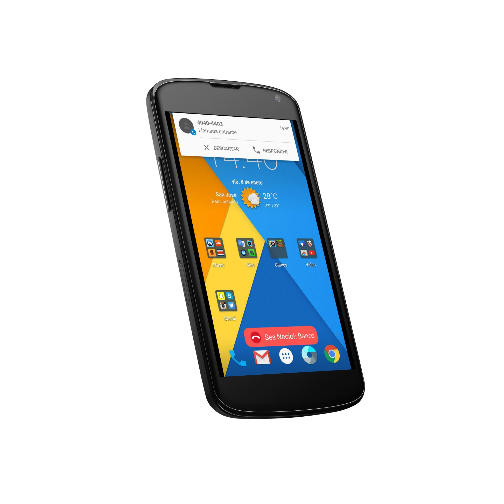
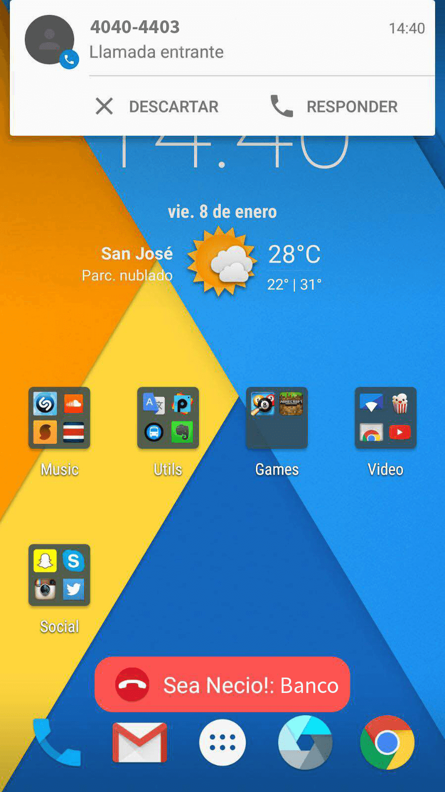
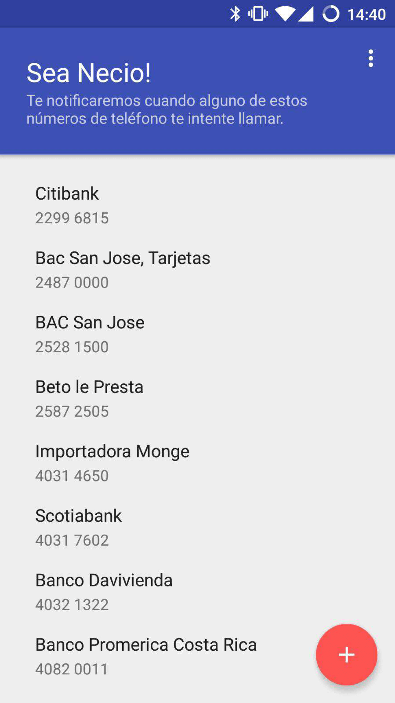
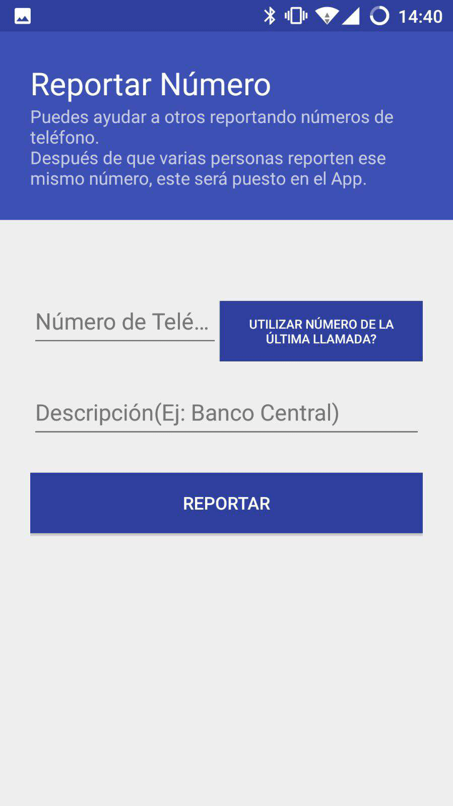
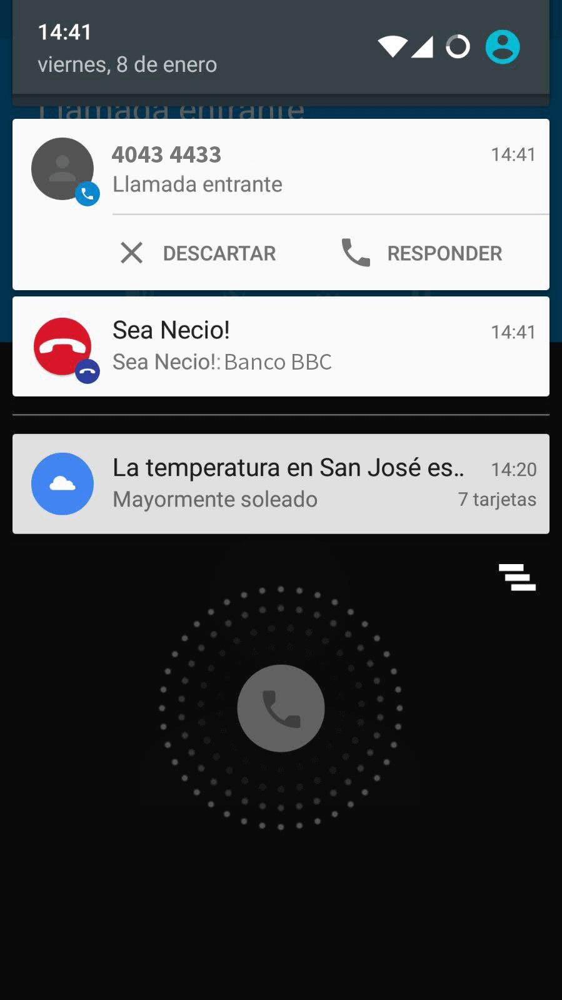

# Sea Necio
Sea Necio (Stop bothering... roughly translated) is an Android App that will notify if the incoming call is a annoying number from a Bank, Call Center or any other annoying source

You can also report phone number thereby help others users of the app. All the phone numbers currently displayed where reported by other users of the App 

Its currently only functioning for `Costa Rica` but it could be easily be apply to other countries / regions.

##Screenshots

##TODO
*Improve design/usability for report number activity
*Add progress indicator on initial load (Normally very quick)
*Better toaster notification on detected number event when the device is blocked
*More test coverage
